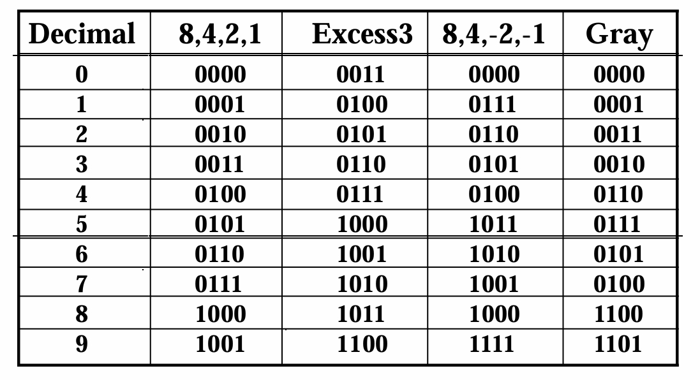
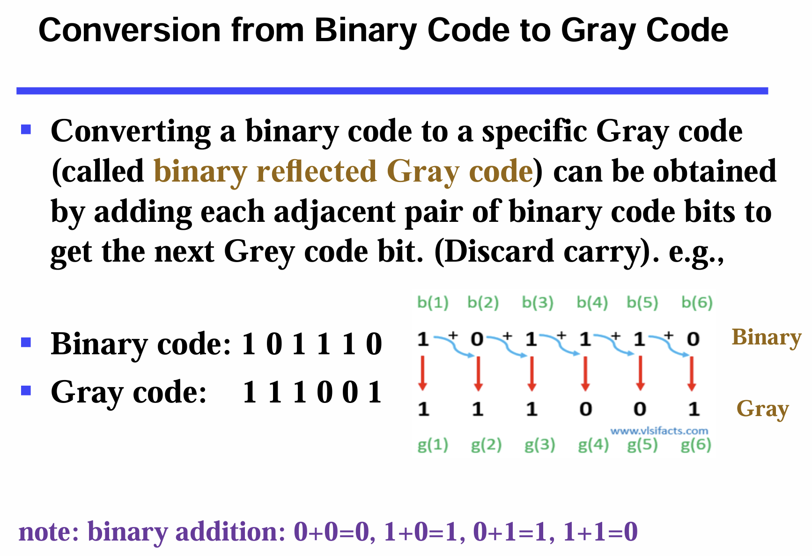

# **CLASS ONE**
  
cm@zju.edu.cn
<hr>

### Propositional Logic v.s. Digital Logic  
Commonalities:
1. Two-valued
2. Same core operators
3. Truth tables  
   
Differences:
1. statement(theoretical) v.s. boolean behaviour(practical)
<hr>

### Analog / digital signals
continuous / discrete  


## Digital systems: 
discrete inputs & internal processing & outputs  
   
   
If falls in threshold region, the signal will be **floating**.  
  
宽进严出。  
Inputs use a narrow threshold region to act as sensitive detectors, while outputs use internal gain to create a wide "forbidden zone," acting as strong drivers to maximize noise margin and ensure signal integrity.  

**Noise margin (噪声容限)**： The difference between the tolerable output and 
input ranges is called the noise margin. In the picture (a) above, the high-level noise margin is 0.9-0.6=0.3 and the low-level noise margin is 0.4-0.1=0.3 (Noise margins are always defined as positive numbers).

## Arithmetic
- LSB: Least Significant Bit  最低有效位  
- MSB: Most ~ ~

## Bases conversion
### Decimal to Binary:   
Method 1: repeatedly subtract the largest power of 2  

  
Method 2: seperately process the integer part and the fraction part  

```python
 #integer part processing
 while remainder != 0:
    divide the integer by 2
    read the remainder

 reverse the string of remainders
```
For example:
```c
/*
770 in decimal -> ??? in binary?

770/2=385...0
385/2=192...1
192/2=96....0
96/2=48.....0
48/2=24.....0
24/2=12.....0
12/2=6......0
6/2=3.......0
3/2=1.......1
1/2=0.......1
            ↑ This column is the so-called remainders string

Thus, 770 in decimal is (1100000010) in binary.
*/
```

<hr>

```python
 #fraction part processing
 while True:
    read the integer part (0 / 1)
    multiply the fraction part by 2
```
For example:
```c
/*
0.567 in decimal is approximately 0.??? in binary (keeping ten decimal places)?

2*0.567=1.134 -> 1
2*0.134=0.268 -> 0
2*0.268=0.536 -> 0
2*0.536=1.072 -> 1
2*0.072=0.144 -> 0
2*0.144=0.288 -> 0
2*0.288=0.576 -> 0
2*0.576=1.152 -> 1
2*0.152=0.304 -> 0
2*0.304=0.608 -> 0

Thus, 0.567 in decimal is approximately (0.1001000100) in binary.
*/
```

### Octal (Hexadecimal) to Binary and back:
 Restate & Regroup  
 (67.731)<sub>8</sub> =(110 111 . 111 011 001)<sub>2</sub> -- Restate

### Octal to Hexadecimal and back:
Use Binary as a bridge.

## Binary Coded Decimal (BCD)
8,4,2,1: weighted code  
only encodes the first ten values from 0 to 9  (six invalid codes from 1010 to 1111)  
**sacrificing storage density** but providing exact precision  <br><br>
BCD addition example:  
Rules: If the digit sum is > 9, add one to the next significant digit.
```c
2905 + 1897
  0010  1001  0000  0101
+ 0001  1000  1001  0111
  0100 10010  1010  1100   //don't forget to carry in when this number is greater than 1001
+ 0000  0110  0110  0110   //add 6 and abandon the MSB
  0100  1000  0000  0010
  4     8     0     2
= 4802
```
```c
987 + 205
  1001  1000  0111
+ 0010  0000  0101
  1011  1001  1100
+ 0110  0000  0110
 10001  1001  0010
  11    9     2         //mention that '10001' should be treated as '0001 | 0001', a.k.a.'11' in decimal
= 1192
```

**Conversion v.s. Coding**  
13<sub>10</sub> = 1101<sub>2</sub> (this is conversion: mathematically equal)  
13<sub>10</sub> <=> 0001 | 0011  (this is coding: equivalent)  

## Gray codes
Only one bit different between two adjacent positions/numbers.  


### A simple executable algorithm:

  
**HAMILTONIAN CYCLE ???**

## **One-hot code**: only one "1"
- simple decoding logic
- high switching efficiency

## Even Parity , Odd Parity
Add a <u>parity bit (0/1)</u> at the end of the data bits to make the number of 1's in the whole string is even/odd (even parity / odd parity).Then check if the number of 1's in the whole string after transmission is still even/odd.  
CANNOT detect more-than-1-bit errors.