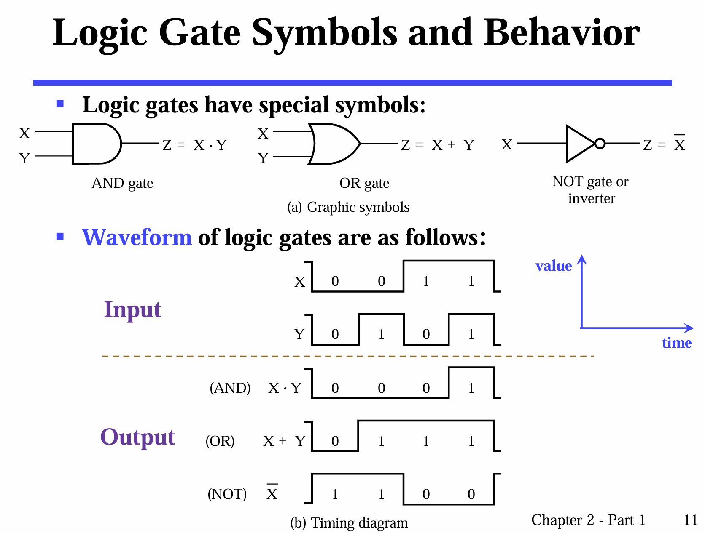
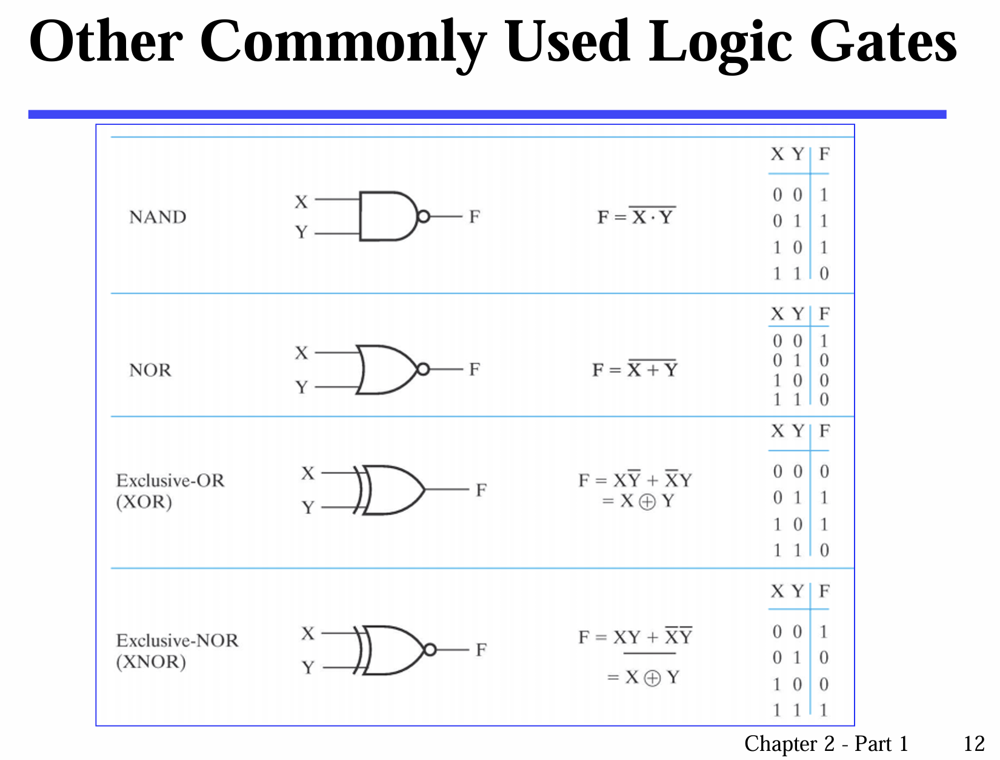
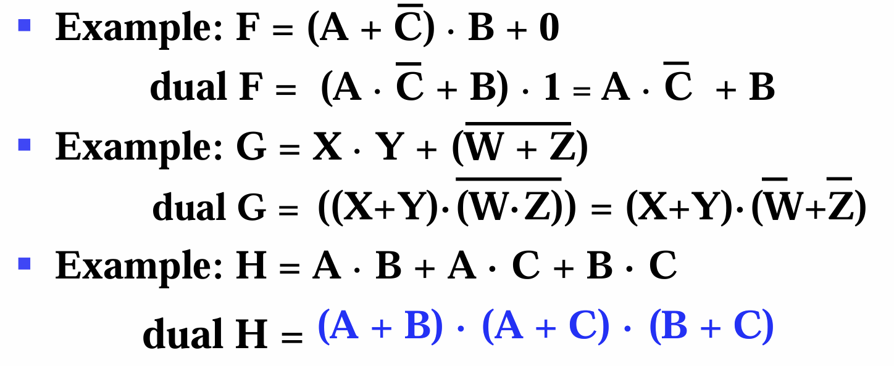
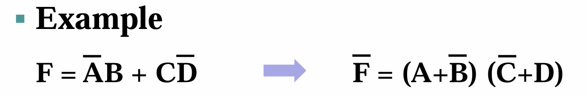
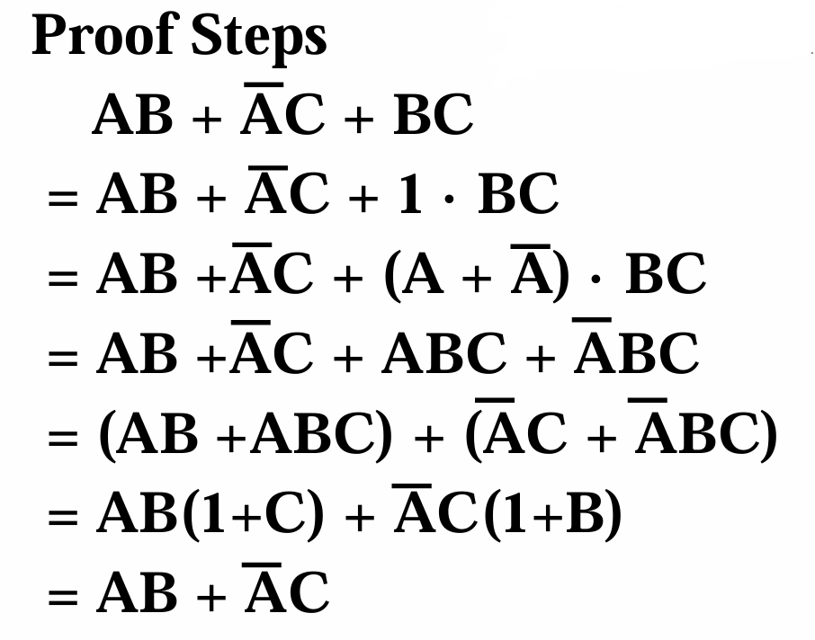

# **CLASS TWO**

## Logical operations
NOTATIONS:
- AND: `·` or `×`
- OR: `+`       
  (Indicates that: priority: AND > OR)
- NOT: "overbar" or `x'` or `~x`

## Logic gates
relays -> vacuum tubes -> transistors  

### **Symbols and Waveform :**  
  
 
Some other commonly-used gates: 
  
 

### **Universal gate:**   
A gate type that <u>alone</u> can be used to implement all possible boolean functions.  (so-called funtionally complete)  
**NAND** and **NOR**  

### **Gate delay**

### **Expressions :**
1. Truth table
2. Equation
3. Logic diagram (the diagram that includes many gate symbols)
4. Waveforms

## Boolean Algebra
### **Basic Identities:**  (the same as in DM, but different notations)  
As for AND, OR and NOT:
- Commutative
- Associative
- Distributive
- De Morgan's  

(Not for NAND, NOR, etc.)

**Priority:**  () -> NOT -> AND -> OR

**PS:** Absorption Theorem:  
`A + A · B = A`

### **Duality Theorem**
As for an equation:
- interchanging AND and OR
- interchanging 0 and 1
- properly add brackets, to keep the same calculating sequence as the original expression

Then, the dual expression is also a correct equation.

  

PS: The third one is self-dual.

**Self-dual:** The dual expression = ITSELF (Have same truth value)

### **Substitution Theorem**: 换元恒等

### **Complementary Theorem**
complement n. 余数；互补
 

If A and B satisfy:  
- `A · B = 0`
- `A + B = 1`

We can imply that B is the complement of A (B = A').

**Complementing Functions**  
For logic function F, the <u>inverse function</u> of the original function is obtained by: 
- interchanging AND (+) and OR (·) 
- complementing each constant value and literal 
- Also, remain the original calculating sequence  

 

We can also use DeMorgan's Law to inverse the function. (examples omitted)  
`Break the line, change the sign.`

### **Consensus Theorem**
AB + AC + BC = AB + AC   
