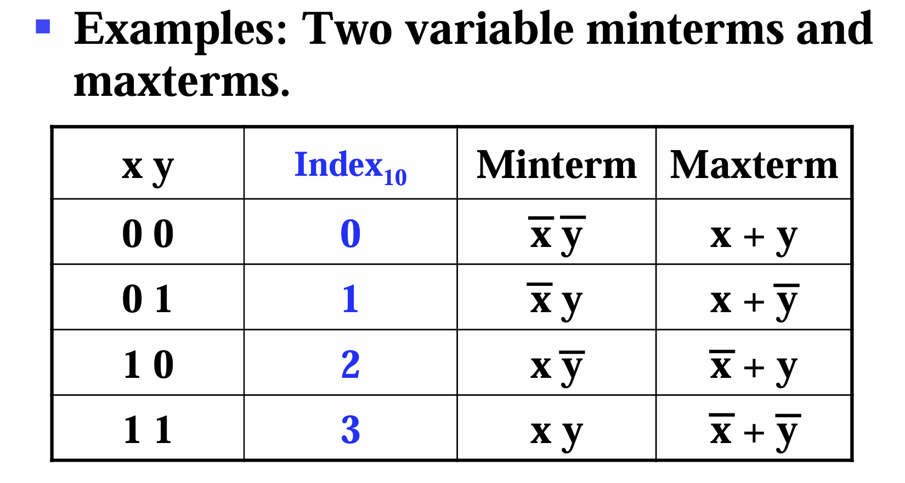
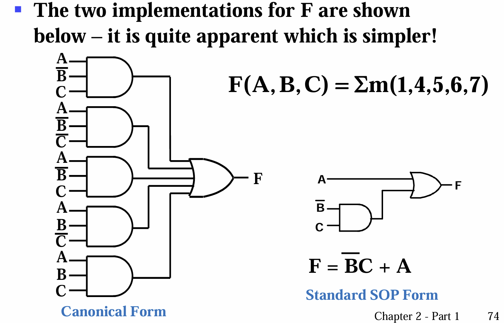
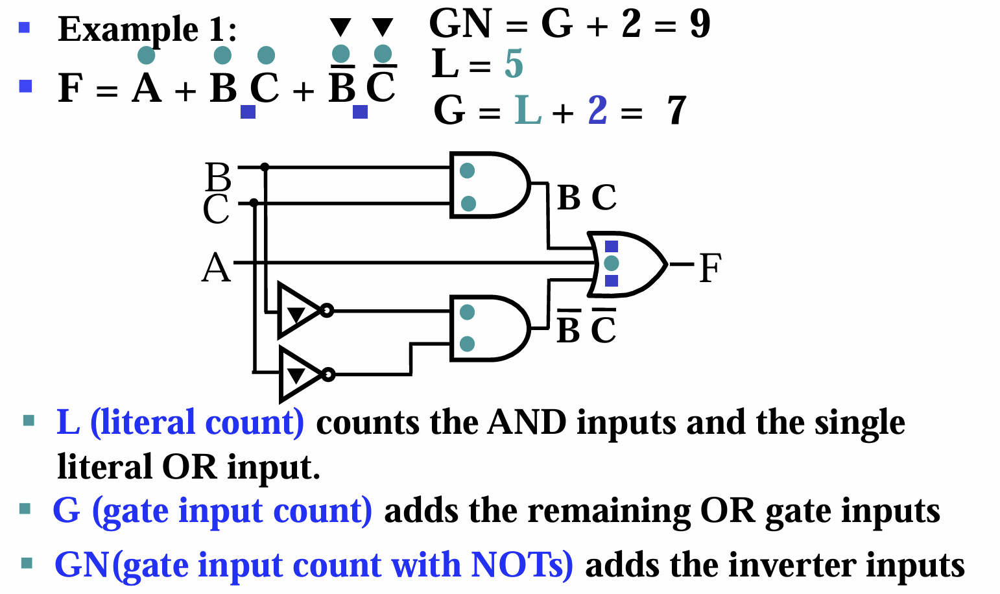
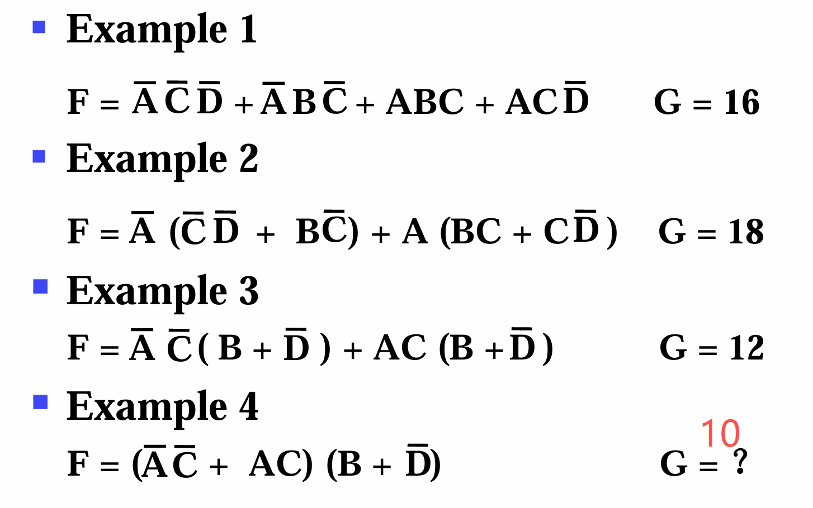
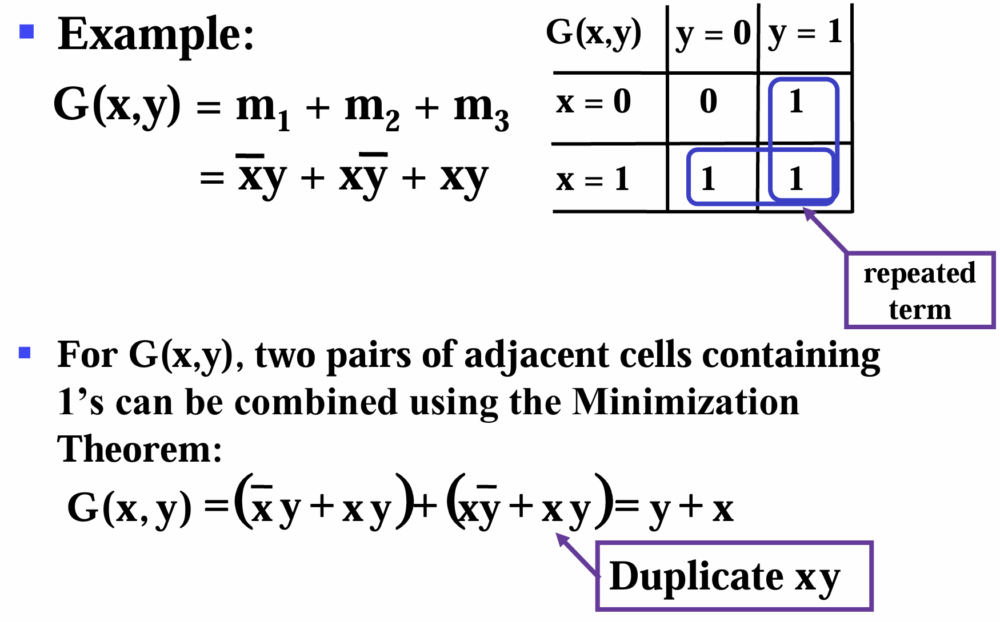
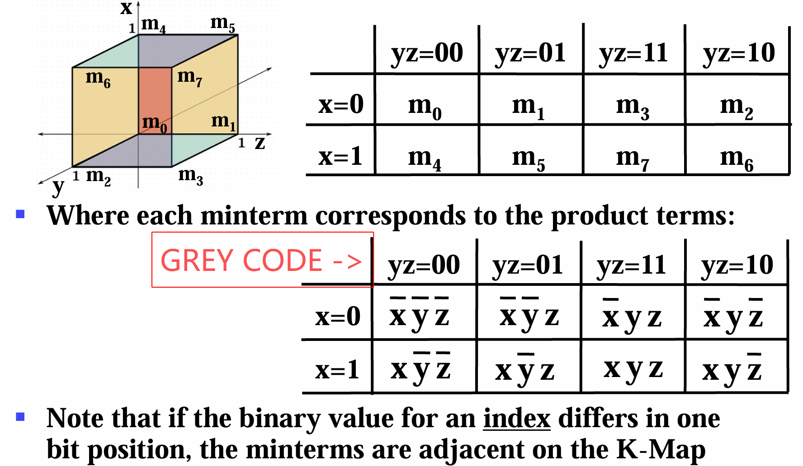
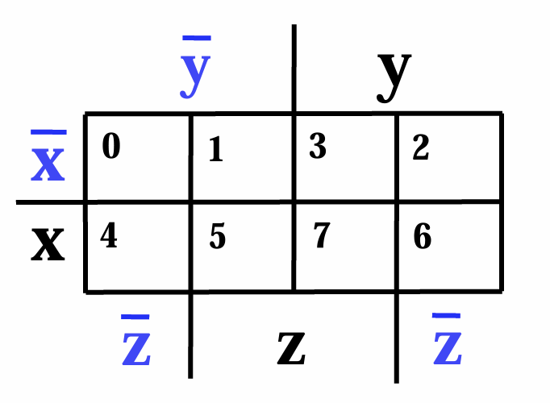
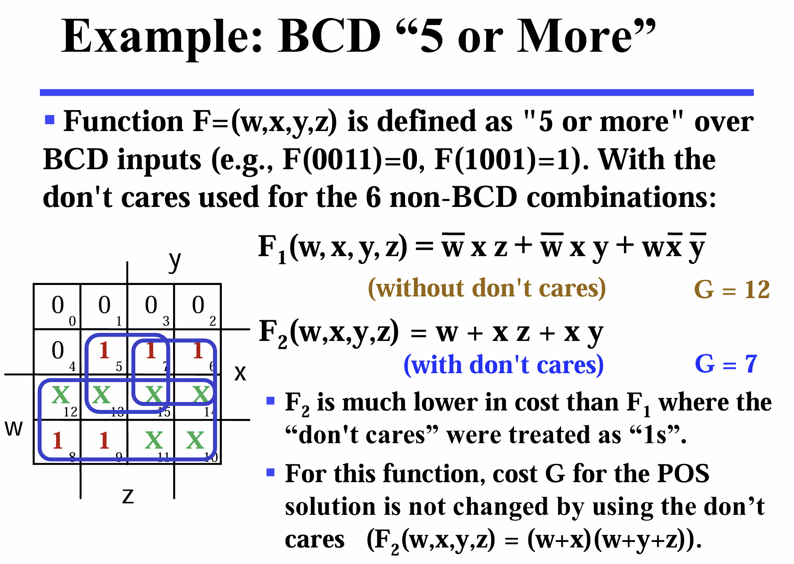

# **CLASS THREE**

## Canonical Forms

### SOM and POM
- Sum of Minterms (minterm: a conjunction with only one assignment of input makes it 1)  
- Product of Maxterms (maxterm: a disjunction with only one assignment of input makes it 0)

  

mx: the minterm whose index10 is x.  
Mx: maxterm ...  

Shorthand:
- m1+m4+m5+m6+m7 = &Sigma;m(1,4,5,6,7)  
- And POM uses &Pi;.  
  
**NOTICE that:** mx and Mx are complements to each other.

>The complement of a function expressed as a SOM is constructed by selecting the minterms missing in the SOM.  
E.G. F(x,y,z) = &Sigma;m(1,3,6,7) implies F'(x,y,z) = &Sigma;m(0,2,4,5)

>To convert between SOM and POM:   
Identify the terms that are NOT included in the expression.   
Combine all the terms using the corresponding form.   
E.G. &Sigma;m(1,3,6,7) = &Pi;M(0,2,4,5)

### Simplification
**Original expression -> Canonical -> Simplified**
1. Segmentation: ensure every term contains all the variables
2. Deduplication
3. Merging

## Standard Forms

Where terms can only contains part of all variables.

### SOP and POS
- Sum of Products: DNF  
- Product od sums: CNF

  

## Circuit Optimization

### Literal cost
How many literals are in the expression.

### Gate Input cost
   
  

1. Calculate Literal cost (L)
2. Add the number AND/OR calculations (**Without the last ones (output)**)
3. Add the number of "NOT variable"s (GN) (**Do not count duplicatedly**)

   

## Karnaugh map (K-map)

Serves as a bridge between Canonical and Standard.

>  
>
>  
>
>**Notice that:** m0 is adjacent to m2.

### Alternative Map Labeling

No need of writing Gray codes while processing 3 variables.  
  

**NOTICE:** Always form the largest rectangular (e.g. 2x2 or 2x4) directly instead of forming several smaller ones.

### Don't Cares in K-maps

**Definition:** The outputs of those inputs illegal, whose truth value can be either 0 or 1. (e.g. Let F(x,y,z,w) requires a 4-bits BCD input, making 6 invalid inputs whose output value is not defined and cared about.)

How does this theory simplify our optimization of a circuit?  
