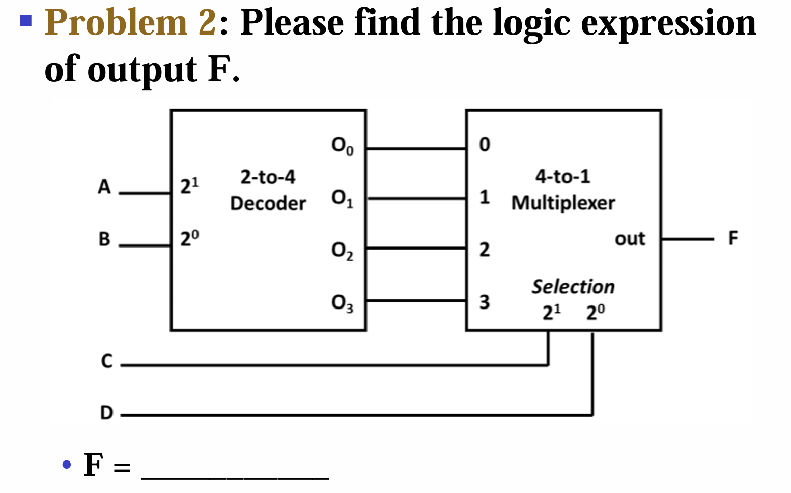

# **CLASS FIVE**

## Combinational logic circuit

**Definition:** A combinational circuit is one where the output depends **only on the current input values**. It has **no memory** of past inputs or outputs.  

**Properties:**
>Behavior: The output changes immediately (after a very short propagation delay) as soon as any input changes.  
No feedback loops (no connection from output back to input).  
No clock is needed.  

**Examples:**
- logic gates
- adders
- MUX
- decoders and encoders

<span style = "color: grey">

**In comparison:**

>Sequential Logic Circuit  
A sequential logic circuit is one where the output depends on both the current inputs **and the past history of inputs** (i.e., the internal state). It has memory.

</span>

### Analysis

1. List the Boolean funcs for all signals. Then obtain F.
2. Simplify the expression.

### Design

1. Specification
2. Formulation: derive an initial Boolean expression
3. Optimization
4. Technology mapping (工艺映射): **use least number of gates**
5. Verification: Verilog programming & simulation

```verilog
module lamp_control(s1,s2,s3,F ); 
input   s1,s2,s3; 
output  F; 
wire    s1,s2,s3,F; 

assign  F= (~s3&~s2&s1) | (~s3&s2&~s1) | (s3&~s2&~s1) | (s3&s2&s1);

endmodule
```

## Technology Parameter

### Fan-in and Fan-out

Definition:  
1. Fan-in  – the number of inputs available on a gate  
    <span style="color:gray">There should not be too much Fan-ins, or the voltage will be not intense enough.</span>
2. Fan-out – the number of standard loads driven by a gate output  
    <span style="color:gray">There should not be too much Fan-outs, or the transition time will be too long.</span>

## Enabling function: "EN"

**Definition:** An enabling function is a control signal that **turns a circuit or a signal path on or off**. When the enable is active, the circuit operates normally; when inactive, the output is forced to a fixed state (usually 0, high-impedance, or the previous value depending on the circuit type).

**Common examples:**
1. **AND gate as an enable**  
If you connect one input of an AND gate to a signal (A) and the other to an enable (EN), then:  
When EN = 1 → Output = A (signal passes through)  
When EN = 0 → Output = 0 (signal blocked)  
This is a simple gated buffer or transmission gate.

2. **Tri-state buffer enable**  
A tri-state buffer has a data input, an enable input, and an output.  
Enable = 1 → Output = Data (active)  
Enable = 0 → Output = High-Z (disconnected, allowing other devices to share the same wire)

3. **Decoder enable**  
A decoder (e.g., 3-to-8 decoder) typically has one or more enable pins. If the enable is inactive, all outputs are forced to 0 (or 1, depending on design), regardless of the address inputs.

**AND-EN and OR-EN:** two simple ways to implement an enable function using <u>Rudimentary functions</u> (AND and OR).

<span style = "color:grey">

>"Rudimentary" means basic and primitive. Hence "Rudimentary functions" means AND, OR and NOT gate.

</span>

### Multiple-bits

Containing several wires in a single thick wire, with merging and spliting at start and end.  

## Decoder & Encoder & Multiplexer & Demultiplexer

### **Decoder**

```
BCD input -> Decimal output LED (Display decoder)
```

```
BCD -> One-hot
```

To avoid high fan-in in the case like 64-to-2<sup>64</sup> decoder, use <u>divide and conquer</u>.  

<image src="photos/divide_and_conquer.png" wdth=400px>  

**By means of decoders, all logic funcs can be constructed.**
1. decode
2. draw the product of all minterms

### **Demultiplexer**

An input signal will be output in different channels depending on EN status.

A decoder with EN.

### **Encoder**

The reverse of decoder.

### **Multiplexer (MUX)**

Selecting of data or information is a critical function in digital systems and computers.   

Circuits that perform selecting have: 
1. A *set of information inputs* from which the selection 
is made 
2. A *set of control lines* for making the selection 
3. A single output 


Logic circuits that perform selecting are called 
**multiplexers**.  
Selecting can be done by decoder plus AND-OR 
gates or three-state buffers.  

>**Basic operation**  
>
>**Inputs**: $2^n$ data inputs, $n$ select lines, 1 enable (optional)  
**Output**: 1 line  
**Formula**: Output = the input selected by the binary value on the select lines.  

  